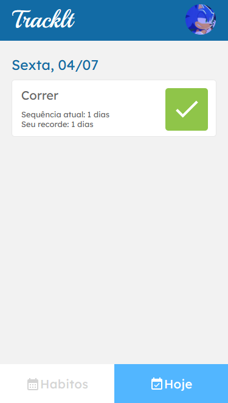

# Tracklt - Seu Gerenciador de Hábitos Diários



## 🚀 Sobre o Projeto

O "Tracklt" é uma aplicação web intuitiva e eficiente projetada para ajudar usuários a criar, acompanhar e gerenciar seus hábitos diários. Com um sistema robusto de cadastro e login integrado a uma API, você pode manter o controle das suas metas pessoais, marcar o progresso a cada dia e visualizar seu histórico de hábitos. Mantenha-se motivado observando sua sequência de dias cumpridos e organize sua rotina de forma simples e eficaz.

## ✨ Funcionalidades

O sistema oferece as seguintes funcionalidades principais:

* **Sistema de Autenticação Completo:**
    * **Página de Registro:** Permite que novos usuários criem uma conta para acessar a plataforma.
    * **Página de Login:** Autenticação segura para usuários existentes.
* **Gerenciamento de Hábitos de Hoje:**
    * **Página "Hoje":** Exibe todos os hábitos que devem ser cumpridos no dia atual.
    * **Marcação de Progresso:** Capacidade de marcar um hábito como "feito" ou "desmarcar" (caso tenha sido um engano).
    * **Controle de Sequência Diária (Streak):** A cada marcação, a sequência diária de cumprimento do hábito é atualizada, incentivando a consistência.
* **Gerenciamento de Todos os Hábitos:**
    * **Página "Hábitos":** Lista todos os hábitos cadastrados pelo usuário.
    * **Detalhes do Hábito:** Exibe o nome de cada hábito e os dias da semana em que ele deve ser cumprido.
    * **Formulário de Criação de Hábito:**
        * Botão dedicado para abrir um formulário intuitivo de criação.
        * Campos para o usuário preencher o nome do novo hábito e selecionar os dias da semana em que deseja realizá-lo.
        * Atualização dinâmica da lista de hábitos na página após a criação bem-sucedida, sem necessidade de recarregar a página.

## 🛠️ Tecnologias Utilizadas

O projeto foi desenvolvido utilizando as seguintes tecnologias:

* [React](https://react.dev/) - Biblioteca JavaScript para construção de interfaces de usuário.
* [Styled-components](https://styled-components.com/) - Para estilização de componentes com CSS-in-JS.
* [Axios](https://axios-http.com/) - Cliente HTTP baseado em Promises para fazer requisições à API.
* [Day.js](https://day.js.org/) - Biblioteca leve de data e hora para formatação de datas.
* [React Router DOM](https://reactrouter.com/en/main) - Para roteamento na aplicação.
* `useContext` - Para gerenciamento de estado global de autenticação (usuário, token).

## 🚀 Como Executar o Projeto

Siga os passos abaixo para configurar e executar o projeto em sua máquina local.

### Pré-requisitos

Certifique-se de ter as seguintes ferramentas instaladas:

* [Node.js](https://nodejs.org/en/) (versão 14 ou superior recomendada)
* [npm](https://www.npmjs.com/) ou [Yarn](https://yarnpkg.com/)

### Instalação

1.  **Clone o repositório:**
    ```bash
    git clone https://github.com/Yasmim-Cabral/tracklt
    cd tracklt
    ```
2.  **Instale as dependências do frontend:**
    ```bash
    npm install --legacy-peer-deps
    # ou
    yarn install --legacy-peer-deps
    ```

### Execução

Para iniciar a aplicação:

```bash
npm run dev
# ou
yarn run dev
```

### ⚙️ Como Testar o Projeto

Você pode experimentar o Cineflex diretamente no seu navegador através do seguinte link:

[Link do Deploy no Vercel](https://tracklt-delta.vercel.app)
